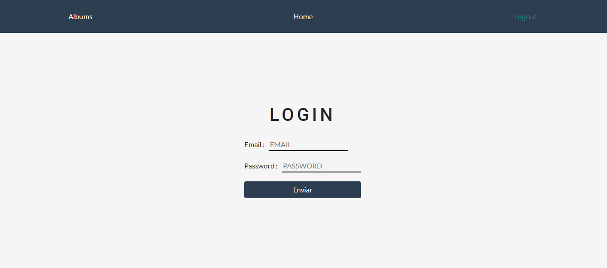
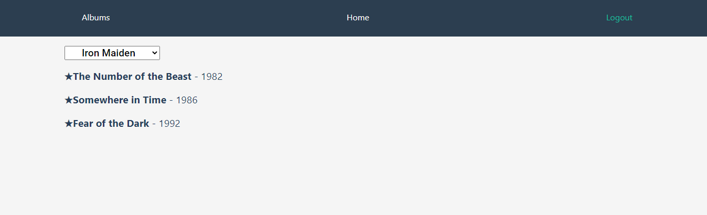

# Development Challenge for React by Melina

## to compile install all the dependencies (described in package.json file) using

```
npm install 
```

### and then 

```
npm start
```

### the email allowed to access is "challenge@nubceo.com" and any password
### you can't access to the other routes without it but will go to login automatically again

## Functionalities:
### Login-logout (with private routes)

### Bands menu get from an API with a filter by gender by clicking you get more information about the band and a link to the albums

## _Preview_ :eyes::


